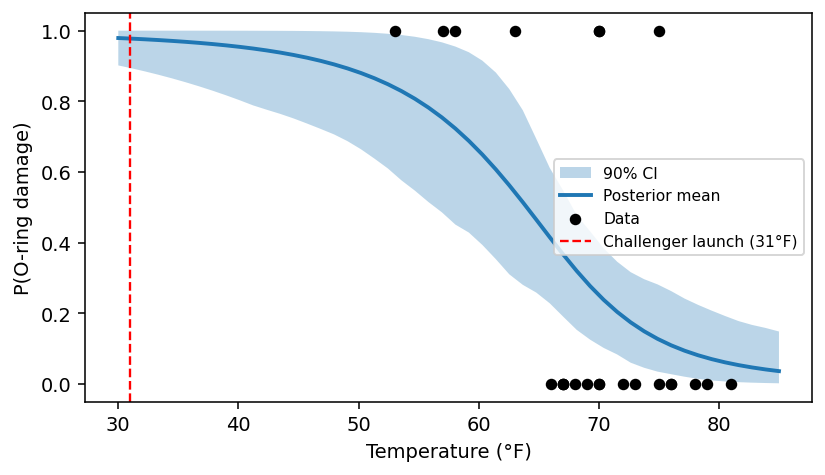

# ProbPipe

[](https://github.com/TARPS-group/prob-pipe/actions/workflows/ci.yml)
[](https://codecov.io/gh/TARPS-group/prob-pipe)
[](https://tarps-group.github.io/prob-pipe/)

ProbPipe is a Python framework for building probabilistic pipelines with automated uncertainty quantification. Its core organizing principle is **distributions in, distributions out**: every node in a pipeline can consume and emit probability distributions, enabling principled uncertainty propagation across the entire workflow.

Most workflows for probabilistic inference can be described in terms of **distributions**, **fixed inputs**, **operations** that transform distributions, and **differentiation** with respect to fixed inputs. Implementing these workflows, however, is harder than describing them. There are **algorithmic challenges**: many possible algorithms exist for the same operation, spread across incompatible packages. And there are **representational challenges**: algorithms require or output specific distribution formats that may not be compatible with other parts of the workflow. ProbPipe manages representations and algorithms automatically by default, while giving you control over these choices when you want it.

**[Documentation](https://tarps-group.github.io/prob-pipe/)** | **[Getting Started](https://tarps-group.github.io/prob-pipe/tutorials/getting_started/)** | **[API Reference](https://tarps-group.github.io/prob-pipe/api/distributions/)**

## Key Features

- **Protocol-based distributions** -- capabilities declared via `@runtime_checkable` protocols (`SupportsSampling`, `SupportsLogProb`, `SupportsMean`, ...), enabling structural subtyping across backends.
- **Automatic uncertainty propagation** -- `@workflow_function` broadcasting: pass a distribution where a function expects a concrete value and get a distribution back.
- **MCMC inference** -- NUTS/HMC with automatic gradient-free RWMH fallback; diagnostics (acceptance rate, divergences, tree depth) on every run.
- **Multiple backends** -- native TFP, nutpie, Stan (via BridgeStan), and PyMC models, all unified behind `condition_on`.
- **Automatic distribution conversion** -- converter registry for moment-matching and sampling-based conversion between distribution types.
- **JAX-native** -- `vmap`, `jit`, `grad` throughout; TFP substrate for distribution math.
- **Provenance tracking** -- every distribution records its lineage from inputs through operations.
- **Prefect orchestration** -- distribute pipeline steps across machines without code changes.

## Installation

Requires Python >= 3.12 (tested on 3.12 and 3.13).

```bash
git clone https://github.com/TARPS-group/prob-pipe.git
cd prob-pipe
pip install .
```

Core dependencies: JAX and TensorFlow Probability. ProbPipe uses [tfp-nightly](https://pypi.org/project/tfp-nightly/), which is the [recommended approach](https://github.com/tensorflow/probability/issues/1994#issuecomment-3129033043) for TFP on JAX since stable TFP releases are tied to TensorFlow and often lag behind JAX.

Optional extras:

```bash
pip install .[dev]       # pytest, jupyter, matplotlib, graphviz
pip install .[prefect]   # Prefect orchestration backend
pip install .[stan]      # Stan models via BridgeStan + CmdStanPy
pip install .[pymc]      # PyMC model integration
pip install .[nutpie]    # nutpie MCMC sampler
```

## Quick Example

```python
import jax, jax.numpy as jnp, numpy as np
from probpipe import MultivariateNormal, SimpleModel, workflow_function, condition_on, mean

# 1. Define a logistic regression model (non-conjugate)
class LogisticLikelihood:
    def log_likelihood(self, params, data):
        logits = params[0] + params[1] * data[:, 0]
        return jnp.sum(data[:, 1] * logits - jnp.log(1 + jnp.exp(logits)))

prior = MultivariateNormal(loc=jnp.zeros(2), cov=5.0 * jnp.eye(2))
model = SimpleModel(prior, LogisticLikelihood())

# 2. Condition on data -- runs NUTS automatically
x_obs = jax.random.normal(jax.random.PRNGKey(42), shape=(80,))
y_obs = jax.random.bernoulli(jax.random.PRNGKey(1), jax.nn.sigmoid(-1 + 2 * x_obs))
data = jnp.column_stack([x_obs, y_obs])

posterior = condition_on(model, data, num_results=2000, num_warmup=1000, random_seed=0)
posterior       # MCMCApproximateDistribution(num_chains=1, num_draws=2000, ...)
mean(posterior) # Array([-1.38, 1.77], dtype=float32)

# 3. Propagate uncertainty -- pass a distribution where a value is expected
@workflow_function
def predict_prob(params, x):
    return jax.nn.sigmoid(params[0] + params[1] * x)

x_grid = jnp.linspace(-3, 3, 100)
predictive = predict_prob(params=posterior, x=x_grid)
predictive      # EmpiricalDistribution(n=2000) over predicted P(y=1|x)
```

Broadcasting samples from the posterior and evaluates the function for each draw, returning the full predictive distribution:

```python
import matplotlib.pyplot as plt

S = np.array(predictive.samples)  # (2000, 100) — one curve per posterior draw
lo, hi = np.percentile(S, [5, 95], axis=0)
plt.fill_between(x_grid, lo, hi, alpha=0.3, label="90% CI")
plt.plot(x_grid, S.mean(axis=0), lw=2, label="Posterior mean")
plt.plot(x_grid, jax.nn.sigmoid(-1.0 + 2.0 * x_grid), "k--", label="True")
plt.scatter(np.array(x_obs), np.array(y_obs), s=12, alpha=0.4, label="Data")
plt.xlabel("x"); plt.ylabel("P(y = 1 | x)"); plt.legend(fontsize=8)
```



## Next Steps

- **[Getting Started tutorial](https://tarps-group.github.io/prob-pipe/tutorials/getting_started/)** -- iterative Bayesian model building with ProbPipe
- **[API Reference](https://tarps-group.github.io/prob-pipe/api/distributions/)** -- full class and function documentation

## Contributing

See [CONTRIBUTING.md](CONTRIBUTING.md) for development setup, PR workflow, and guidelines.
