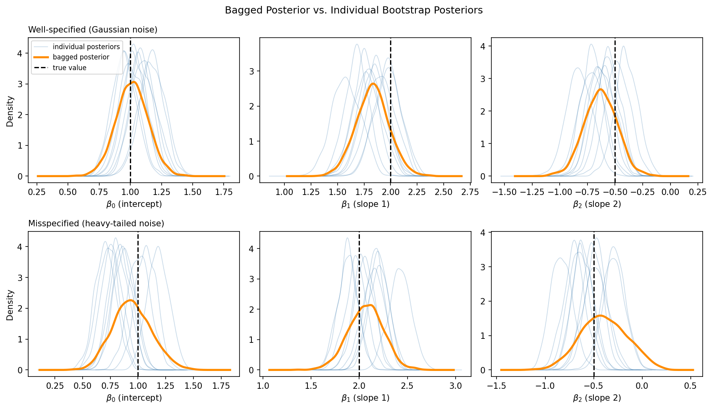
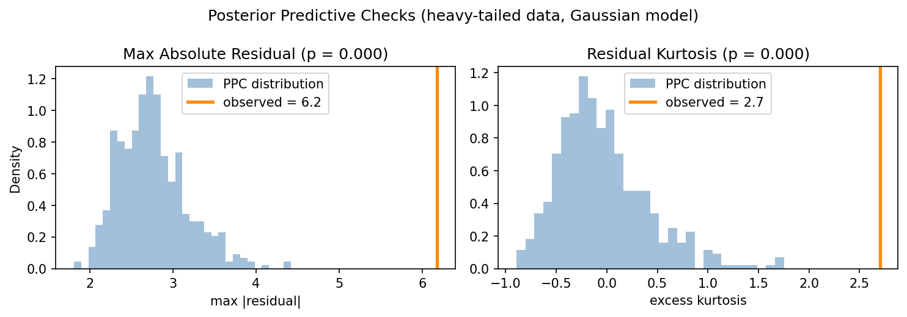

# Getting Started

## Installation

Requires Python >= 3.12.

```bash
git clone https://github.com/TARPS-group/prob-pipe.git
cd prob-pipe
pip install .
```

Core dependencies: JAX and TensorFlow Probability (nightly).

### Optional extras

```bash
pip install .[dev]       # pytest, jupyter, matplotlib, graphviz, docs
pip install .[prefect]   # Prefect orchestration backend
pip install .[stan]      # Stan models via BridgeStan + CmdStanPy
pip install .[pymc]      # PyMC model integration
pip install .[nutpie]    # nutpie MCMC sampler
```

## Walkthrough: Bayesian Linear Regression

This walkthrough demonstrates ProbPipe's approach to posterior inference, uncertainty propagation, and reproducible analysis. We'll fit a Bayesian linear regression, compute bagged posteriors for robust uncertainty quantification, and propagate posterior uncertainty through predictions.

### 1. Define the model

ProbPipe models are assembled from a prior distribution and a likelihood. Operations like `sample()`, `log_prob()`, `mean()`, and `condition_on()` are standalone workflow functions — you call `mean(dist)`, not `dist.mean()`.

```python
import jax
import jax.numpy as jnp
from probpipe import (
    MultivariateNormal, SimpleModel, EmpiricalDistribution,
    JointBootstrapDistribution,
    condition_on, sample, mean, variance, log_prob,
)
from probpipe.modeling import Likelihood
from probpipe.core.node import wf

class LinearRegressionLikelihood(Likelihood):
    @wf
    def log_likelihood(self, params, data):
        x, y = data[:, :-1], data[:, -1]
        predicted = x @ params[1:] + params[0]
        return jnp.sum(-0.5 * (y - predicted) ** 2)

prior = MultivariateNormal(loc=jnp.zeros(3), cov=10.0 * jnp.eye(3))
model = SimpleModel(prior, LinearRegressionLikelihood())
```

The `SimpleModel` dynamically delegates to the prior's protocols: if the prior supports `SupportsLogProb`, the model composes prior log-probability with the likelihood for gradient-based inference. If the prior supports `SupportsSampling`, the model can generate prior predictive samples.

### 2. Fit the posterior

Condition the model on data to run MCMC. When the model supports log-probability gradients (as here), `condition_on` uses NUTS. Otherwise it falls back to gradient-free Metropolis-Hastings.

```python
# Synthetic data: y = 1.0 + 2.0*x1 - 0.5*x2 + noise
key = jax.random.PRNGKey(42)
N = 100
x = jax.random.normal(key, shape=(N, 2))
y = 1.0 + 2.0 * x[:, 0] - 0.5 * x[:, 1] + 0.3 * jax.random.normal(key, shape=(N,))
data = jnp.column_stack([x, y])

posterior = condition_on(model, data, num_results=1000, num_warmup=500, random_seed=0)
mean(posterior)       # Array([1.009, 1.943, -0.549], dtype=float32)
variance(posterior)   # Array([0.0097, 0.0143, 0.0120], dtype=float32)
```

The result is an `MCMCApproximateDistribution` — an `EmpiricalDistribution` with chain structure and diagnostics:

```python
posterior.num_chains       # 1
posterior.diagnostics      # InferenceDiagnostics(algorithm=nuts, accept_rate=0.954, ...)
posterior.draws(chain=0)   # Array of shape (1000, 3)
```

### 3. Bagged posteriors for reproducible inference

Under model misspecification, standard Bayesian posteriors can be unreliable — credible sets from replicate datasets may not overlap
([Huggins & Miller, 2024](https://doi.org/10.1214/24-EJS2237)).
The *bagged posterior* averages over posteriors conditioned on bootstrapped datasets,
yielding reproducible uncertainty quantification.

ProbPipe makes this natural. `JointBootstrapDistribution` represents the bootstrap sampling distribution over datasets — each sample is a full bootstrapped dataset drawn i.i.d. with replacement:

```python
# Wrap the observed data as a bootstrap sampling distribution
bootstrap_data = JointBootstrapDistribution(EmpiricalDistribution(data))

# Broadcasting condition_on over bootstrap datasets returns the bagged posterior
bagged_posterior = condition_on(model, bootstrap_data)
```

The result is the **bagged posterior** — a mixture distribution that averages over the individual bootstrap posteriors. The individual posteriors are accessible via `.components`.

By default, `JointBootstrapDistribution` sets the bootstrap dataset size equal to the original dataset size (the standard nonparametric bootstrap). You can customize it — for example, using `n=int(N**0.95)` as recommended for BayesBag model selection:

```python
bootstrap_data = JointBootstrapDistribution(EmpiricalDistribution(data), n=int(N**0.95))
bootstrap_data.n   # 79
```

To see why bagging matters, compare the well-specified Gaussian data above with a **misspecified** scenario — heavy-tailed noise that violates the model's Gaussian assumption:

```python
import numpy as np
rng = np.random.default_rng(42)
x_ht = jax.random.normal(jax.random.PRNGKey(99), shape=(N, 2))
noise_ht = rng.standard_t(df=2, size=N)
y_ht = 1.0 + 2.0 * np.array(x_ht[:, 0]) - 0.5 * np.array(x_ht[:, 1]) + noise_ht
data_ht = jnp.column_stack([x_ht, jnp.array(y_ht, dtype=jnp.float32)])

posterior_ht = condition_on(model, data_ht, num_results=1000, num_warmup=500, random_seed=0)

bootstrap_ht = JointBootstrapDistribution(EmpiricalDistribution(data_ht))
bagged_posterior_ht = condition_on(model, bootstrap_ht)
```

Plotting both cases side by side:

```python
import matplotlib.pyplot as plt
from scipy.stats import gaussian_kde
from probpipe import sample

param_names = [r"$\beta_0$ (intercept)", r"$\beta_1$ (slope 1)", r"$\beta_2$ (slope 2)"]
true_values = [1.0, 2.0, -0.5]

fig, all_axes = plt.subplots(2, 3, figsize=(12, 7))

for row, (label, bagged, axes) in enumerate([
    ("Well-specified (Gaussian noise)", bagged_posterior, all_axes[0]),
    ("Misspecified (heavy-tailed noise)", bagged_posterior_ht, all_axes[1]),
]):
    individual_posteriors = bagged.components

    for j, (ax, name, truth) in enumerate(zip(axes, param_names, true_values)):
        for i, post in enumerate(individual_posteriors[:10]):
            draws = post.samples[:, j]
            kde = gaussian_kde(np.array(draws))
            xs = np.linspace(float(draws.min()) - 0.3, float(draws.max()) + 0.3, 200)
            ax.plot(xs, kde(xs), alpha=0.3, lw=0.8, color="steelblue",
                    label="individual posteriors" if i == 0 else None)

        bagged_draws = np.array(sample(bagged, sample_shape=(2000,))[:, j])
        kde_bag = gaussian_kde(bagged_draws)
        xs = np.linspace(float(bagged_draws.min()) - 0.3, float(bagged_draws.max()) + 0.3, 200)
        ax.plot(xs, kde_bag(xs), color="darkorange", lw=2.5, label="bagged posterior")

        ax.axvline(truth, color="black", linestyle="--", lw=1.5, label="true value")
        ax.set_xlabel(name)
    axes[0].set_ylabel("Density")
    axes[0].set_title(label, fontsize=10, loc="left")
    if row == 0:
        axes[0].legend(fontsize=8)
fig.suptitle("Bagged Posterior vs. Individual Bootstrap Posteriors")
fig.tight_layout()
```



**Top row (well-specified):** The bootstrap posteriors are tightly clustered and the bagged posterior nearly coincides with each individual one. Here bagging is mildly conservative — the extra width is small.

**Bottom row (misspecified):** Heavy-tailed noise causes individual posteriors to spread apart (the outlier-sensitive Gaussian likelihood produces different estimates for different bootstrap datasets). The bagged posterior is noticeably wider, correctly reflecting the additional uncertainty from model misspecification.

### 4. Use external samplers

ProbPipe supports multiple inference backends. Stan models use CmdStan's built-in NUTS sampler for `condition_on`. You can also use nutpie (a Rust-based NUTS implementation) for Stan or PyMC models:

```python
from probpipe.modeling import StanModel
from probpipe.inference import condition_on_nutpie

# Stan model — condition_on delegates to CmdStan's NUTS
stan_mod = StanModel("my_model.stan", data={"N": N})
stan_posterior = condition_on(stan_mod, {"x": x, "y": y})

# Or use nutpie for potentially faster sampling
nutpie_posterior = condition_on_nutpie(stan_mod, {"x": x, "y": y}, num_results=2000)
```

### 5. Propagate posterior uncertainty

When a `WorkflowFunction` receives a distribution where it expects a concrete value, ProbPipe automatically broadcasts over samples. Start with a reusable prediction function:

```python
from probpipe import WorkflowFunction
import numpy as np

def predict(params, x):
    return x @ params[1:] + params[0]

predict_wf = WorkflowFunction(func=predict)

# Posterior uncertainty propagates automatically
x_new = jnp.array([[0.5, -0.3]])
predictive = predict_wf(params=posterior, x_new=x_new)
mean(predictive)       # posterior predictive mean
variance(predictive)   # posterior predictive variance
```

Broadcasting returns the output distribution directly. Pass `include_inputs=True` to get a `BroadcastDistribution` that preserves input–output alignment (e.g. for inspecting which input samples produced which outputs).

This same pattern makes **posterior predictive checks** natural. Separate the pipeline into reusable pieces — simulation and test statistics — with `predict` driving the generative model:

```python
x_obs, y_obs = np.array(data_ht[:, :-1]), np.array(data_ht[:, -1])
rng_ppc = np.random.default_rng(123)

def simulate_replicate(params):
    """Draw y_rep from the model: y_rep ~ N(predict(params, x), I)."""
    return np.array(predict(params, x_obs)) + rng_ppc.normal(size=len(x_obs))

# Test statistics on residuals
def max_abs_residual(residuals):
    return float(np.max(np.abs(residuals)))

def excess_kurtosis(residuals):
    centered = residuals - np.mean(residuals)
    return float(np.mean((centered / np.std(residuals))**4) - 3.0)

# Compose: simulate replicate, compute residuals, apply statistic
def ppc_max_impl(params):
    y_rep = simulate_replicate(params)
    return max_abs_residual(y_rep - np.array(predict(params, x_obs)))

def ppc_kurt_impl(params):
    y_rep = simulate_replicate(params)
    return excess_kurtosis(y_rep - np.array(predict(params, x_obs)))

ppc_max = WorkflowFunction(func=ppc_max_impl, n_broadcast_samples=500)
ppc_kurt = WorkflowFunction(func=ppc_kurt_impl, n_broadcast_samples=500)

ppc_max_dist = ppc_max(params=posterior_ht)
ppc_kurt_dist = ppc_kurt(params=posterior_ht)
```

Compare to the observed residual statistics:

```python
params_hat = np.array(mean(posterior_ht))
resid_obs = y_obs - np.array(predict(params_hat, x_obs))
obs_max = max_abs_residual(resid_obs)      # 6.18
obs_kurt = excess_kurtosis(resid_obs)      # 2.70

p_max = float(np.mean(np.array(ppc_max_dist.samples) >= obs_max))    # 0.000
p_kurt = float(np.mean(np.array(ppc_kurt_dist.samples) >= obs_kurt)) # 0.000
```

Both p-values are extreme — the Gaussian model cannot reproduce the large residuals or heavy tails in the observed data:



### 6. Track provenance

Every distribution records its lineage automatically. Provenance chains enable full reproducibility:

```python
from probpipe import provenance_ancestors

posterior.source
# Provenance('nuts', parents=[MultivariateNormal])

provenance_ancestors(predictive)
# [MCMCApproximateDistribution(num_chains=1, ..., algorithm=nuts, ...),
#  MultivariateNormal(event_shape=(3,))]
```

### 7. Differentiate through distributions

Since everything is built on JAX, you can compute gradients of distribution operations — useful for sensitivity analysis, MLE, and variational inference:

```python
from probpipe import Normal

sensor = Normal(loc=0.0, scale=0.5)

# Score function: d/d(x) log p(x)
jax.grad(lambda x: log_prob(sensor, x))(0.5)   # Array(-2.0, dtype=float32)
```

### 8. Interoperate with TFP and scipy

The converter registry handles automatic bidirectional conversion between ProbPipe, raw TFP, and scipy.stats distributions:

```python
from probpipe import converter_registry, Normal
import tensorflow_probability.substrates.jax.distributions as tfd
import scipy.stats as ss

# Raw TFP and scipy distributions work directly in workflows
result_from_tfp = predict(params=tfd.Normal(loc=0.0, scale=1.0), x_new=x_new)

# Convert ProbPipe distributions to scipy for use with scipy tools
from scipy.stats._distn_infrastructure import rv_frozen
sp = converter_registry.convert(sensor, rv_frozen)
sp.ppf(0.975)  # 0.9800 (95th percentile via scipy)
```

## Next Steps

Explore the [tutorials](tutorials.md) for in-depth coverage of distributions, joint models, conditioning, automatic differentiation, and modular inference pipelines.
